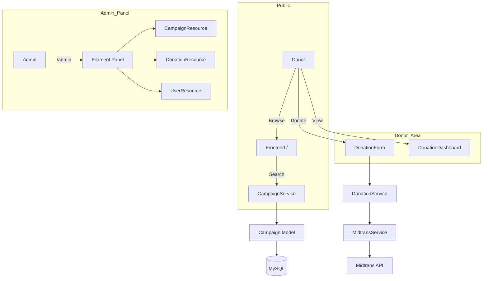
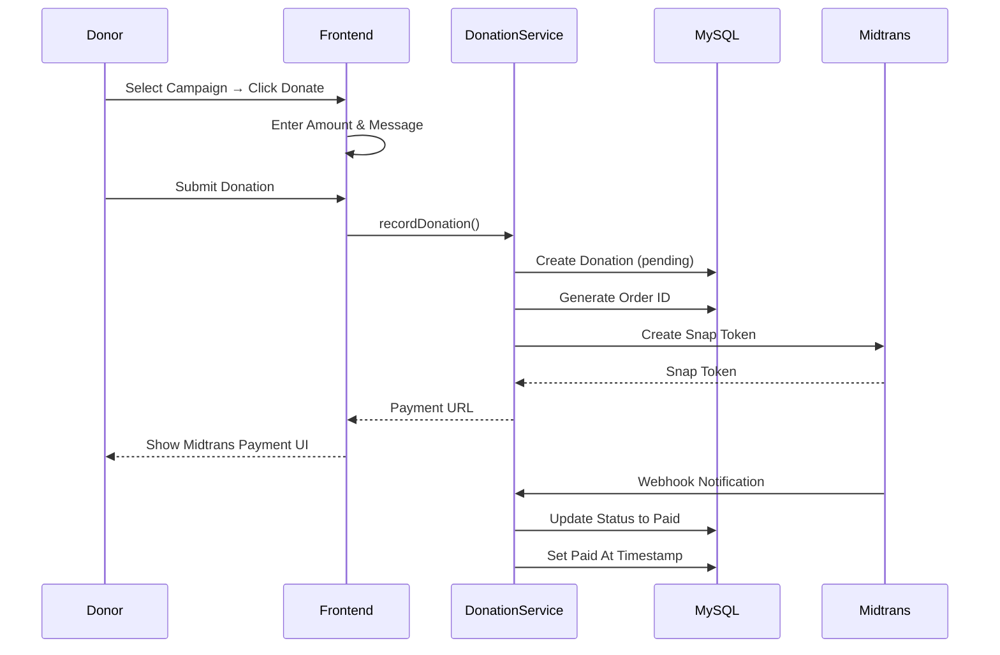

# 🎗️ DonasiKita - Laravel Donation Platform


A donation platform built with **Laravel 12 + Filament 4**. This application allows users to browse donation campaigns, make contributions, and track their donation history. Features include campaign management, real-time payment processing with Midtrans, and a comprehensive admin panel.

Designed for the Indonesian market (IDR currency, Asia/Jakarta timezone).

> 🎓 **Learning Project**: This is an experimental project built while learning fullstack Laravel development. The codebase started from a tutorial boilerplate and has been significantly modified and expanded. This is a work in progress as I continue learning!

---

## 🙏 Credits

This project was initially based on the tutorial and boilerplate from **[Mas Asdita (codingtengahmalam)](https://github.com/codingtengahmalam)** — an Indonesian Laravel educator who provides practical tutorials for building real-world applications.

The original boilerplate provided the foundation for this project. Since then, the codebase has been heavily modified with many custom features, UI redesigns, and architectural improvements as part of my Laravel learning journey.

---

## 📚 Table of Contents

- [Features](#-features)
- [System Architecture](#-system-architecture)
- [Project Structure](#-project-structure)
- [Prerequisites](#-prerequisites)
- [Getting Started](#-getting-started)
    - [1. Clone & Install](#1-clone--install)
    - [2. Environment Configuration](#2-environment-configuration)
    - [3. Database Setup](#3-database-setup)
    - [4. Run Application](#4-run-application)
- [Available Scripts](#-available-scripts)
- [Application Flow](#-application-flow)
- [Architecture Patterns](#-architecture-patterns)
- [Testing](#-testing)
- [Troubleshooting](#-troubleshooting)

---

## ✨ Features

- **Campaign Management** - Browse and search donation campaigns by category
- **Donation Processing** - Online donations with Midtrans payment gateway
- **Real-time Payment Status** - Webhook integration for automatic status updates
- **User Dashboard** - View donation history and manage contributions
- **Filament Admin Panel** - Full CRUD for campaigns, categories, donations, and users
- **Role-Based Access Control** - Super admin and donor roles using Spatie Permissions
- **Anonymous Donations** - Option to hide donor identity
- **Campaign Updates** - Article system for campaign progress updates
- **Responsive Design** - Tailwind CSS with custom components
- **Soft Deletes** - Data safety with soft delete on domain models
- **Laravel Breeze Authentication** - Login, register, password reset
- **Custom Admin Login** - Styled Filament login page

---

## 🏗 System Architecture

### High-Level Application Flow



### Donation Flow



---

## 📁 Project Structure

```
donasikita-project/
├── app/
│   ├── Filament/
│   │   └── Resources/              # Admin panel resources
│   │       ├── Campaigns/
│   │       ├── Donations/
│   │       └── Users/
│   ├── Http/
│   │   ├── Controllers/
│   │   │   ├── FrontController.php       # Public pages
│   │   │   ├── MidtransController.php    # Payment webhook
│   │   │   └── Auth/                     # Breeze auth controllers
│   │   └── Requests/                     # Form requests
│   ├── Livewire/
│   │   ├── Campaign/                     # Campaign components
│   │   │   ├── DonationForm.php
│   │   │   └── ShowCampaign.php
│   │   ├── Dashboard/                    # Dashboard components
│   │   │   └── Donations.php
│   │   └── Landing/                      # Landing page components
│   ├── Models/
│   │   ├── User.php
│   │   ├── Campaign.php
│   │   ├── CampaignCategory.php
│   │   ├── CampaignArticle.php
│   │   ├── Donation.php
│   │   └── Attachment.php
│   ├── Services/
│   │   ├── CampaignService.php      # Campaign operations
│   │   └── DonationService.php      # Donation processing
│   └── Providers/
│       └── Filament/
│           └── AdminPanelProvider.php
├── config/
│   └── payment.php                 # Midtrans configuration
├── database/
│   ├── migrations/                 # Database migrations
│   └── seeders/
│       ├── ShieldSeeder.php        # Roles & permissions
│       └── UserSeeder.php          # Default users
├── resources/
│   ├── views/
│   │   ├── livewire/               # Livewire components
│   │   │   ├── campaign/
│   │   │   ├── dashboard/
│   │   │   └── landing/
│   │   ├── components/             # Blade components
│   │   └── layouts/                # Master layouts
│   └── css/
│       └── app.css                 # Tailwind entry
├── routes/
│   ├── web.php                     # Web routes
│   └── api.php                     # API routes (webhooks)
├── tests/                          # Feature & Unit tests
├── .env.example                    # Environment template
├── composer.json                   # PHP dependencies
├── package.json                    # Node dependencies
├── phpunit.xml                     # Test configuration
└── tailwind.config.js              # Tailwind configuration
```

---

## ✅ Prerequisites

Before you begin, ensure you have the following installed:

1. **PHP** (8.4 or later) with extensions:
    - `pdo_mysql`, `mbstring`, `openssl`, `json`, `fileinfo`

2. **Composer** (PHP package manager)

    ```bash
    curl -sS https://getcomposer.org/installer | php
    mv composer.phar /usr/local/bin/composer
    ```

3. **MySQL** (8.0 or later) or MariaDB

4. **Node.js** (18+ or 20+) and **NPM**

5. **Git**

---

## 🚀 Getting Started

Follow these steps to get the application running locally.

### 1. Clone & Install

```bash
git clone <your-repo-url>
cd donasikita-project

# Install PHP dependencies
composer install

# Install Node.js dependencies
npm install
```

### 2. Environment Configuration

Copy the example environment file and configure it:

```bash
cp .env.example .env

# Generate application key
php artisan key:generate
```

**Critical Variables:**

| Variable                 | Description         | Default (Local)         |
| ------------------------ | ------------------- | ----------------------- |
| `APP_NAME`               | Application name    | `DonasiKita`            |
| `APP_URL`                | Base URL            | `http://localhost:8000` |
| `DB_CONNECTION`          | Database driver     | `mysql`                 |
| `DB_HOST`                | Database host       | `127.0.0.1`             |
| `DB_DATABASE`            | Database name       | `donasikita`            |
| `DB_USERNAME`            | Database user       | `root`                  |
| `DB_PASSWORD`            | Database password   | (empty)                 |
| `MIDTRANS_SERVER_KEY`    | Midtrans server key | (from Midtrans)         |
| `MIDTRANS_CLIENT_KEY`    | Midtrans client key | (from Midtrans)         |
| `MIDTRANS_IS_PRODUCTION` | Production mode     | `false`                 |

### 3. Database Setup

**Create the database:**

```bash
# Via MySQL CLI
mysql -u root -p -e "CREATE DATABASE donasikita;"
```

**Run migrations:**

```bash
php artisan migrate
```

**Seed the database:**

```bash
# Seed roles and permissions
php artisan db:seed --class=ShieldSeeder

# Seed default users
php artisan db:seed --class=UserSeeder
```

Default credentials:

- **Super Admin**: `superadmin@example.com` / `example`
- **Donor**: `ahmad.rizki@example.com` / `password`

### 4. Run Application

**Start the development server:**

```bash
# Terminal 1: Laravel dev server
php artisan serve

# Terminal 2: Vite dev server (for assets)
npm run dev
```

The application will be available at:

- **Frontend**: `http://localhost:8000`
- **Admin Panel**: `http://localhost:8000/admin`

**Build for production:**

```bash
npm run build
```

---

## 🧰 Available Scripts

| Script                                   | Description                                              |
| ---------------------------------------- | -------------------------------------------------------- |
| `composer install`                       | Install PHP dependencies                                 |
| `composer dev`                           | Run full dev environment (Laravel + Queue + Logs + Vite) |
| `composer format`                        | Run Laravel Pint (code style fixer)                      |
| `composer format:check`                  | Check code style without fixing                          |
| `composer test`                          | Run PHPUnit tests                                        |
| `composer test:coverage`                 | Run tests with coverage report                           |
| `composer test:coverage-html`            | Generate HTML coverage report                            |
| `composer test:coverage-min`             | Run tests with coverage (min 80%)                        |
| `npm install`                            | Install Node.js dependencies                             |
| `npm run dev`                            | Start Vite development server                            |
| `npm run build`                          | Build assets for production                              |
| `php artisan serve`                      | Start Laravel development server                         |
| `php artisan migrate`                    | Run database migrations                                  |
| `php artisan migrate:fresh --seed`       | Reset DB and seed                                        |
| `php artisan db:seed --class=UserSeeder` | Seed users                                               |
| `php artisan storage:link`               | Create storage symlink                                   |
| `php artisan route:list`                 | List all routes                                          |
| `php artisan pail`                       | Monitor application logs                                 |

---

## 🔄 Application Flow

### Public Routes

| Route                         | Controller/Component    | Description             |
| ----------------------------- | ----------------------- | ----------------------- |
| `GET /`                       | `Landing\Home`          | Homepage with campaigns |
| `GET /campaign/{slug}`        | `Campaign\ShowCampaign` | Campaign detail page    |
| `GET /campaign/{slug}/donate` | `Campaign\DonationForm` | Donation form           |

### Authenticated Routes

| Route                      | Component/Livewire    | Description      |
| -------------------------- | --------------------- | ---------------- |
| `GET /dashboard`           | `Dashboard\Dashboard` | User dashboard   |
| `GET /dashboard/donations` | `Dashboard\Donations` | Donation history |

### Webhook

| Route                        | Controller                    | Description              |
| ---------------------------- | ----------------------------- | ------------------------ |
| `POST /api/webhook/midtrans` | `MidtransController@callback` | Midtrans payment webhook |

---

## 🏗️ Architecture Patterns

### Service Layer Pattern

Controllers are kept thin - business logic lives in Services:

```php
class CampaignController extends Controller
{
    public function __construct(
        private CampaignService $campaignService,
        private DonationService $donationService
    ) {}

    public function show($slug)
    {
        $campaign = $this->campaignService->getBySlug($slug);
        return view('campaign.show', compact('campaign'));
    }
}
```

### Repository-like Service Pattern

```php
class DonationService
{
    public function handleCallback(array $data)
    {
        $donation = Donation::where('order_id', $data['order_id'])->first();

        if (!$donation) {
            return ['success' => false, 'message' => 'Donation not found'];
        }

        // Update status based on transaction_status
        switch ($data['transaction_status']) {
            case 'settlement':
            case 'capture':
                $donation->status = Donation::STATUS_PAID;
                $donation->paid_at = now();
                break;
            // ... other cases
        }

        $donation->save();
        return ['success' => true];
    }
}
```

### Eager Loading (N+1 Prevention)

```php
// ✅ Good: Eager load relationships
$campaign = Campaign::with(['category', 'donations.user'])
    ->findOrFail($id);

// ❌ Bad: N+1 queries
$campaign = Campaign::find($id);
foreach ($campaign->donations as $donation) {
    echo $donation->user->name; // Extra query!
}
```

---

## 🧪 Testing

Run the test suite:

```bash
# Run all tests
composer test

# Run tests with coverage (terminal output)
composer test:coverage

# Generate HTML coverage report
composer test:coverage-html

# Run tests with minimum 80% coverage requirement
composer test:coverage-min

# Or directly with Artisan
php artisan test
php artisan test --coverage
php artisan test --coverage-html=coverage-report

# Run specific test file
php artisan test --filter=CampaignTest

# Run specific test class
php artisan test tests/Unit/Services/DonationServiceTest.php
```

### Test Organization

```
tests/
├── Feature/               # HTTP/Integration tests
│   ├── CampaignPageTest.php
│   └── Auth/
├── Unit/                  # Unit tests
│   ├── Models/
│   │   ├── CampaignTest.php
│   │   └── DonationTest.php
│   └── Services/
│       └── DonationServiceTest.php
└── TestCase.php           # Base test class
```

### Coverage Requirements

This project aims for **80%+ code coverage**. Key areas to test:

- **Services**: Business logic in DonationService, CampaignService
- **Models**: Relationships, scopes, accessors
- **Feature Tests**: HTTP endpoints, Livewire components

### Writing Tests

Example unit test for a Service:

```php
class DonationServiceTest extends TestCase
{
    use RefreshDatabase;

    public function test_handle_callback_updates_donation_status(): void
    {
        $campaign = Campaign::factory()->create();
        $donation = Donation::factory()->create([
            'order_id' => 'TEST-123',
            'status' => Donation::STATUS_PENDING,
        ]);

        $service = new DonationService;
        $result = $service->handleCallback([
            'order_id' => 'TEST-123',
            'transaction_status' => 'settlement',
        ]);

        $this->assertTrue($result['success']);
        $this->assertEquals(Donation::STATUS_PAID, $donation->fresh()->status);
    }
}
```

---

## 🔧 Troubleshooting

| Issue                          | Possible Cause                        | Solution                                                  |
| ------------------------------ | ------------------------------------- | --------------------------------------------------------- |
| **Database connection failed** | MySQL not running / wrong credentials | Start MySQL and check `.env` DB\_\* variables             |
| **Class not found**            | Autoload not updated                  | Run `composer dump-autoload`                              |
| **Storage images not loading** | Symlink not created                   | Run `php artisan storage:link`                            |
| **419 Page Expired**           | CSRF token missing                    | Add `@csrf` to forms                                      |
| **Filament panel 403**         | User doesn't have admin role          | Check user has `super_admin` role                         |
| **Admin login not working**    | Wrong credentials or role             | Use `superadmin@example.com` / `example`                  |
| **Midtrans payment fails**     | Missing/wrong API keys                | Add correct keys to `.env`                                |
| **Migration error**            | Schema mismatch                       | Run `php artisan migrate:fresh --seed` (⚠️ destroys data) |
| **Permission denied**          | File permissions                      | Run `chmod -R 775 storage/`                               |
| **CSS not loading**            | Vite not running                      | Run `npm run dev` in separate terminal                    |
| **Blank page / 500 error**     | Check logs                            | Read `storage/logs/laravel.log`                           |

### Debug Commands

```bash
# Check Laravel version
php artisan --version

# List all routes
php artisan route:list

# Check config in Tinker
php artisan tinker
>>> config('payment.midtrans.server_key')

# Clear all caches
php artisan optimize:clear

# Check migration status
php artisan migrate:status

# Monitor logs in real-time
php artisan pail
```

---

## 🚀 Future Development

This project is actively being developed. The following features are planned for upcoming releases:

### 🎯 Planned Features

| Feature                    | Description                                                                                                                        | Priority |
| -------------------------- | ---------------------------------------------------------------------------------------------------------------------------------- | -------- |
| **Test Coverage**          | Comprehensive unit and feature tests for Services, Controllers, and Models using PHPUnit. Aim for 70%+ code coverage.              | High     |
| **Reward System**          | Point-based loyalty program for donors who make regular contributions. Users can earn points redeemable for badges or recognition. | Medium   |
| **Campaign Analytics**     | Detailed analytics dashboard for campaign owners showing donation trends, donor demographics, and engagement metrics.              | Medium   |
| **Recurring Donations**    | Subscription-based donation system allowing users to set up monthly/weekly automatic contributions.                                | High     |
| **Social Sharing**         | Enhanced social media integration with share buttons, campaign embeds, and viral tracking.                                         | Low      |
| **Multi-language Support** | Full localization support for English and Indonesian with easy expansion to other languages.                                       | Medium   |
| **Advanced Search**        | Full-text search with filters for category, location, donation target, and campaign status.                                        | Medium   |
| **Email Templates**        | Customizable email notification templates for different events (donation received, campaign updates, etc.).                        | Low      |
| **Export Reports**         | PDF/Excel export functionality for campaign owners to download donation reports.                                                   | Low      |

### 📝 Implementation Notes

Personal notes for future development on this experimental project:

- **Test Coverage**: Currently at 22% coverage - aiming for 70%+. Following TDD approach with mocked external services (Midtrans). Priority on Services and Livewire components.
- **Recurring Donations**: Planning to use Laravel's scheduling features with a `subscription` table tracking billing cycles and Midtrans subscription API.
- **Campaign Analytics**: Thinking of using Laravel's caching for aggregating stats and possibly integrating Chart.js for visualizations.
- **Reward System**: Could implement with a simple pivot table between `users` and a new `rewards` table with point calculations based on donation amounts.
- **Multi-language**: Plan to use Laravel's localization features with `__()` helper and language files in `resources/lang/`.
- **Search**: Considering Laravel Scout with database driver for simple full-text search without external dependencies.

This is a learning/experimental project - features and priorities may change as I continue exploring Laravel and PHP best practices.

---

## 📝 Notes

This is a learning project - features and implementation may change as I continue exploring Laravel and PHP best practices. The codebase has evolved significantly from the original tutorial boilerplate with custom modifications to:

- UI/UX design and styling
- Database schema and relationships
- Business logic in services
- Frontend components and layouts
- Admin panel customization
- Payment flow and webhook handling

---

## 📄 License

This project is licensed under the MIT License.

---

Built for learning Laravel through practical donation platform development with **Laravel 12 + Filament 4**.
